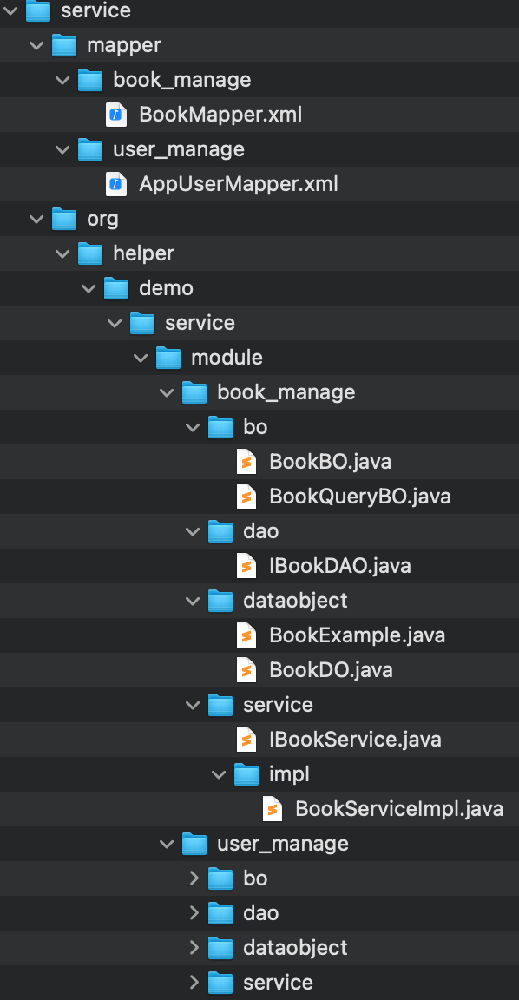

## helper-plugins

* 基于 https://github.com/mybatis/generator 项目提供的插件扩展功能定义模板代码
* mybatis generator生成代码统一注解、注释，形成规范
* ClassPlugin提供对象赋值的自动生成，待完善

## 发布
* https://github.com/helper2018/helper-plugin/releases

## 插件介绍
* mybatis generator 自定义插件
* java对象赋值

---
## mybatis-generator配置
* 命令: mybatis-generator:generate
* 详细配置如下图所示:

---
## Run mybatis-generator
* 使用 app_user、book两张表为例生成的项目目录结构如下：

### 总共分为app和service两块，方便分层


### service 层除了mybatis generator原有的model、mapper等，新增了业务对象（*BO）、Service的增删改查以及单表的分页查询


### application 层增加了对应于service的controller，以及相关的数据传输对象


### 接口文档

---

# IntelliJ IDEA *File and Code Templates* 配置建议

## path
* Preferences | Editor | File and Code Templates
* 将模板中的***作者***改为开发者姓名
## class
```aidl
/*
 * Copyright 2021-2031 the original author or authors.
 *
 * Licensed under the Apache License, Version 2.0 (the "License");
 * you may not use this file except in compliance with the License.
 * You may obtain a copy of the License at
 *
 *      https://www.apache.org/licenses/LICENSE-2.0
 *
 * Unless required by applicable law or agreed to in writing, software
 * distributed under the License is distributed on an "AS IS" BASIS,
 * WITHOUT WARRANTIES OR CONDITIONS OF ANY KIND, either express or implied.
 * See the License for the specific language governing permissions and
 * limitations under the License.
 */
 
#if (${PACKAGE_NAME} && ${PACKAGE_NAME} != "")package ${PACKAGE_NAME};#end
#parse("File Header.java")
import org.slf4j.Logger;
import org.slf4j.LoggerFactory;

/**
 * <p>
 * 类名:${NAME}.
 * ${YEAR}/${MONTH}/${DAY} ${HOUR}:${MINUTE}
 * <p>
 * @author 作者
 * @version 1.0.0
 */
public class ${NAME} {
    private final static Logger logger = LoggerFactory.getLogger(${NAME}.class);
    
}
```
## interface
```aidl
/*
 * Copyright 2021-2031 the original author or authors.
 *
 * Licensed under the Apache License, Version 2.0 (the "License");
 * you may not use this file except in compliance with the License.
 * You may obtain a copy of the License at
 *
 *      https://www.apache.org/licenses/LICENSE-2.0
 *
 * Unless required by applicable law or agreed to in writing, software
 * distributed under the License is distributed on an "AS IS" BASIS,
 * WITHOUT WARRANTIES OR CONDITIONS OF ANY KIND, either express or implied.
 * See the License for the specific language governing permissions and
 * limitations under the License.
 */

#if (${PACKAGE_NAME} && ${PACKAGE_NAME} != "")package ${PACKAGE_NAME};#end
#parse("File Header.java")

/**
 * <p>
 * 接口名:${NAME}.
 * ${YEAR}/${MONTH}/${DAY} ${HOUR}:${MINUTE}
 * <p>
 * @author 作者
 * @version 1.0.0
 */
public interface ${NAME} {

}
```
## enum
```aidl
/*
 * Copyright 2021-2031 the original author or authors.
 *
 * Licensed under the Apache License, Version 2.0 (the "License");
 * you may not use this file except in compliance with the License.
 * You may obtain a copy of the License at
 *
 *      https://www.apache.org/licenses/LICENSE-2.0
 *
 * Unless required by applicable law or agreed to in writing, software
 * distributed under the License is distributed on an "AS IS" BASIS,
 * WITHOUT WARRANTIES OR CONDITIONS OF ANY KIND, either express or implied.
 * See the License for the specific language governing permissions and
 * limitations under the License.
 */
 
#if (${PACKAGE_NAME} && ${PACKAGE_NAME} != "")package ${PACKAGE_NAME};#end
#parse("File Header.java")

/**
 * <p>
 * 枚举类名:${NAME}.
 * ${YEAR}/${MONTH}/${DAY} ${HOUR}:${MINUTE}
 * <p>
 * @author 作者
 * @version 1.0.0
 */
public enum ${NAME} {

}
```
### annotation
```aidl
/*
 * Copyright 2021-2031 the original author or authors.
 *
 * Licensed under the Apache License, Version 2.0 (the "License");
 * you may not use this file except in compliance with the License.
 * You may obtain a copy of the License at
 *
 *      https://www.apache.org/licenses/LICENSE-2.0
 *
 * Unless required by applicable law or agreed to in writing, software
 * distributed under the License is distributed on an "AS IS" BASIS,
 * WITHOUT WARRANTIES OR CONDITIONS OF ANY KIND, either express or implied.
 * See the License for the specific language governing permissions and
 * limitations under the License.
 */
 
#if (${PACKAGE_NAME} && ${PACKAGE_NAME} != "")package ${PACKAGE_NAME};#end
#parse("File Header.java")

/**
 * <p>
 * 注解名:${NAME}.
 * ${YEAR}/${MONTH}/${DAY} ${HOUR}:${MINUTE}
 * <p>
 * @author 作者
 * @version 1.0.0
 */
public @interface ${NAME} {

}
```